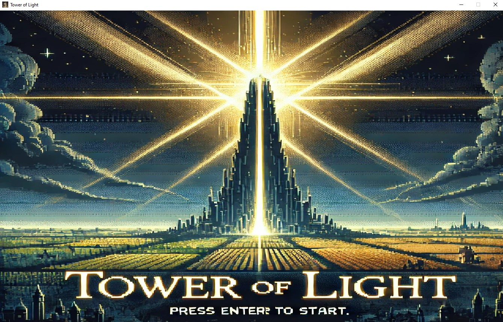
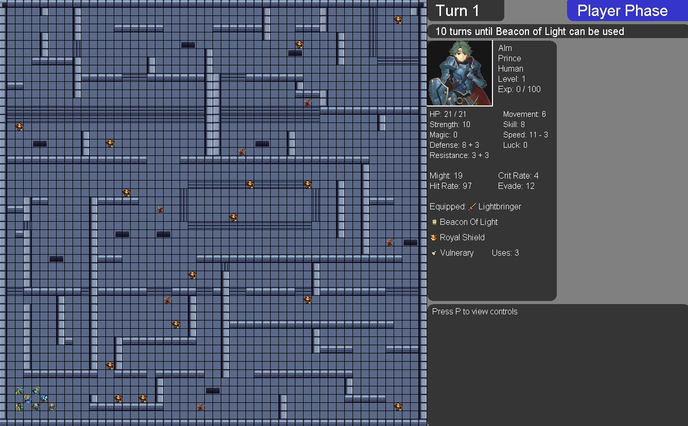
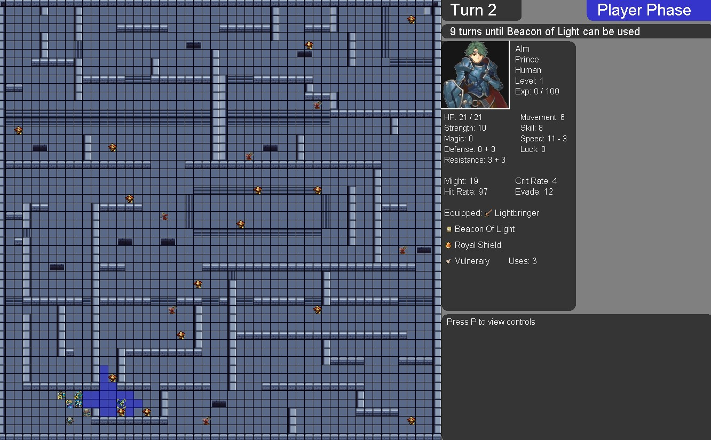
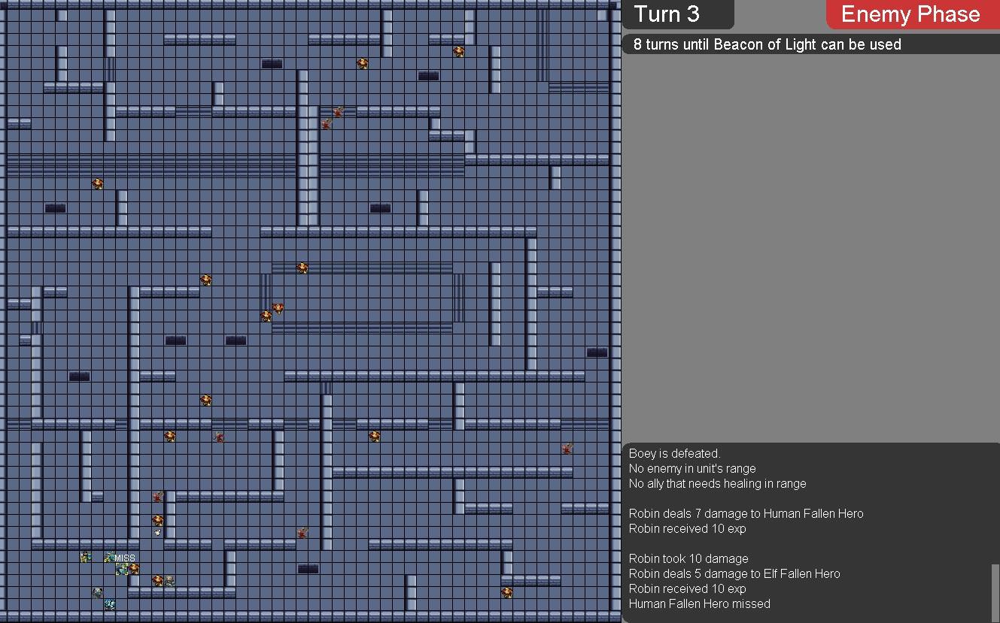
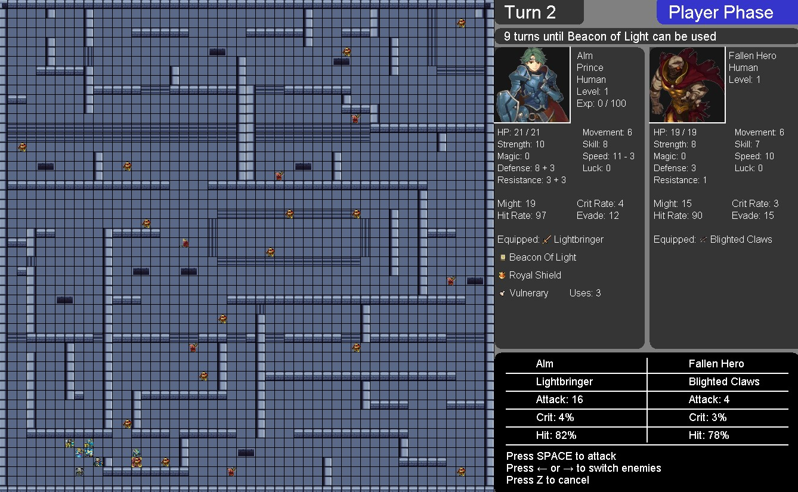
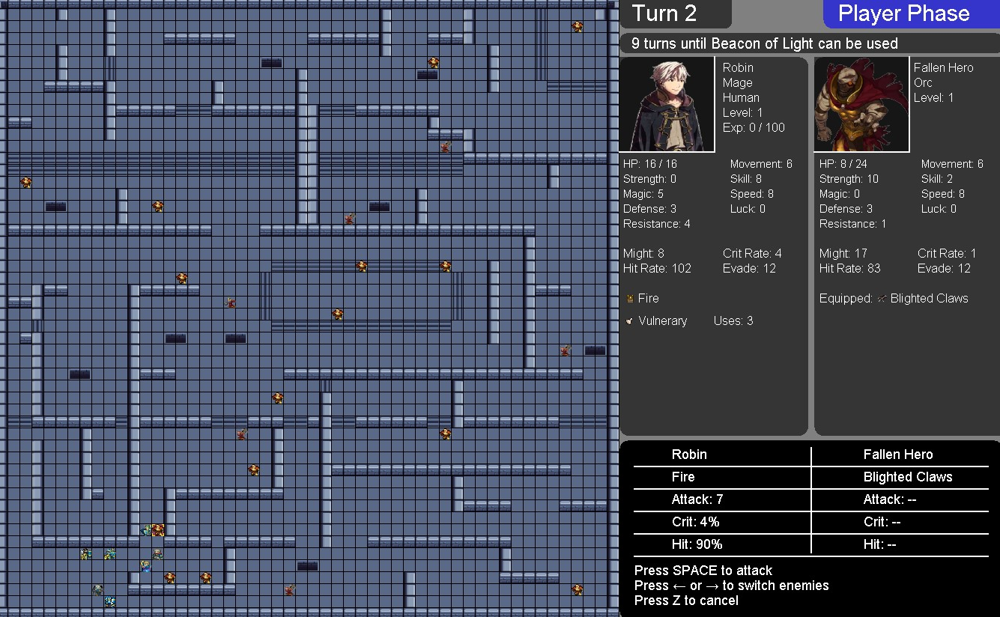
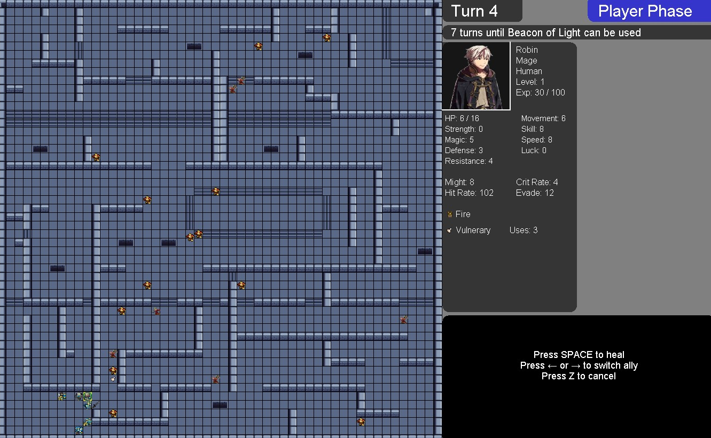
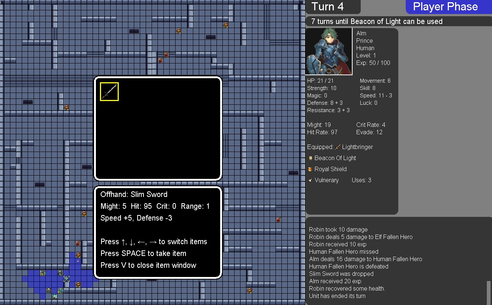
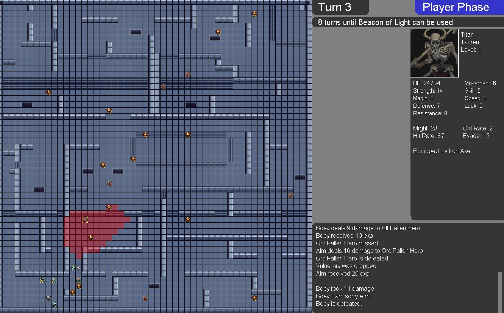
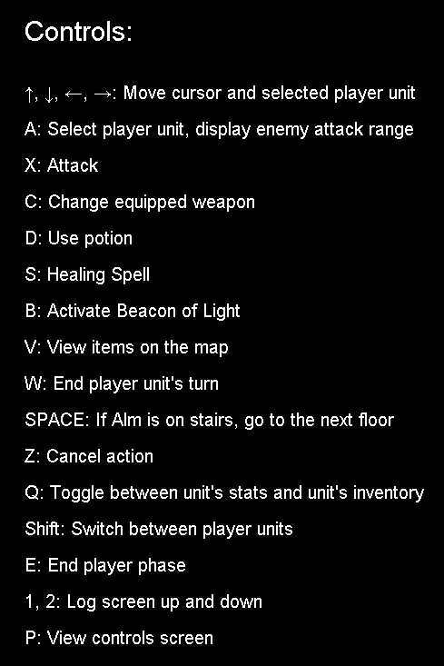

# Tower of Light

Tower of Light is an indie, 2D turn-based strategy RPG where you lead Prince Alm of the kingdom of Valentia and his army to take back the Tower of Light from the Chaos army and defeat the Chaos God Grima that is trying to take over the world. The game emphasizes tactical decision-making, with each move being critical to the success of your army. The game is made from scratch in Java and it features 2D animations, as well as music and sound effects, and was made for my MSc course Object Oriented Programming.

## Gameplay

 

 

## Game Narrative

200 years ago, the Chaos God Grima and his Chaos army tried to take over the world. In the most fatal times, however, the Hero King Marth of the kingdom of Valentia
and his companions used all of their power to resist the Chaos army's invasion and win against them. The Hero King used his sword Lightbringer to unleash the last power
of Light left in the world to seal Grima, because Grima was too powerful to be killed. To remind everyone of these heroic actions the Tower of Light was built, which
also holds enough Light power to help the next heroes defeat the Chaos army if another invasion ever happens. Peace lasted for 200 years and no one thought dark times 
would ever come again. However...

The incentive of the game is for the Prince and his army to reach the final floor of the Tower and defeat the Chaos God and the Chaos army from taking over the world.
The player's army moves a floor at a time. To reach the next floor the Prince needs to create three beacons of light and then your army to defeat that floor's boss. 
Then, the stairs on the north-east of the map appear and your army reaches the next floor.

However, the battle to reach the Chaos God is hard. Your army is going to face a lot of enemies, some that are very powerful, that spawn at different map positions.
The player might be able to get away, but not for long. All the enemies follow closely the player' army and try to eliminate them.  In addition, they get stronger 
and more ferocious with each beacon created. On the other hand, if the player kills the enemies they can drop valuable items, such as weapons, shields, magic rings
and healing potions that will strengthen your army for the tough challenges it will face. The game ends either when the Chaos God is defeated or when the Prince 
is defeated.

It is of benefit to the player's army to kill enemies and equip the dropped items in their main- and off-hand weapon slots, their trinket slot and even their
potion slot. Of course, if there are no potions on the inventory, the player can rest to regain his missing stats. But the rate of recovering is slow and 
enemies might find him easier this way. Of course, your army also includes magic casters that can use both attacking spells on enemies and healing spells on 
allies, and can use all spells from range, but these units generally have weaker defenses and their actions must be thoughfully planned. 

## Features

**Turn-Based Combat:** Engage in strategic battles, carefully planning your moves to outwit your enemies.

| Player Phase                                       | Enemy Phase                      |
|---------------------------------                   |---------------------------------|
|  |  |

**Unique Classes:** Use a variety of character classes, either physical or magical, each with their own distinct strengths, and weaknesses.

**Dynamic Battle System:** The combat system includes attack ranges, weapon types, trinket items and careful positioning, adding depth to each encounter.

| Physical Battle Forecast                           | Magical Battle Forecast                      |
|---------------------------------                   |---------------------------------|
|  |  |

**Ally Healing Forecast**                                
            
 

**Item Selection:** select and pick up new weapons, shields, magic rings and healing potions that will help you in your battle against the chaos army.

 

**Enemy Preview:** Select enemies and view their stats and attack range in order to plan your best moves.

 

**Level up:** Gain experience points to enhance your armys' stats as you progress through the Tower.

**Story-Driven Adventure:** Uncover the mysteries of the Tower as you descend through its treacherous levels, battling powerful foes and discovering the lore
behind the enemies actions.

**Pixel Art Graphics:** Experience retro-style pixel art visuals that give life to the world and characters of Tower of Light.

## Controls

 
